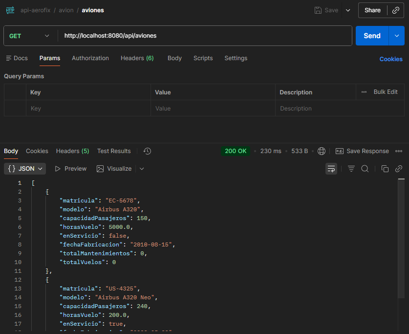
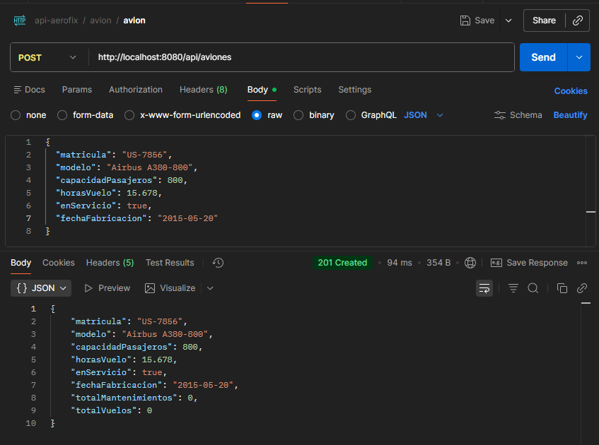
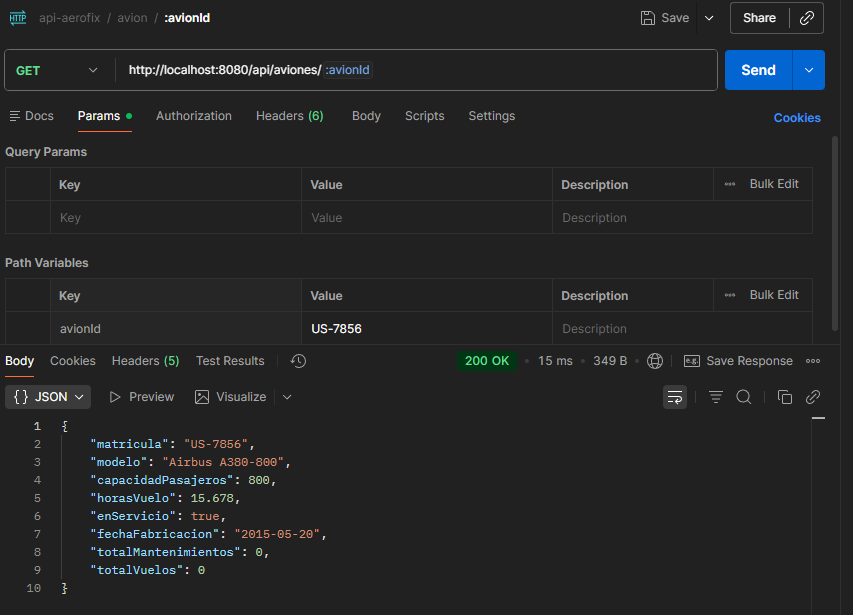
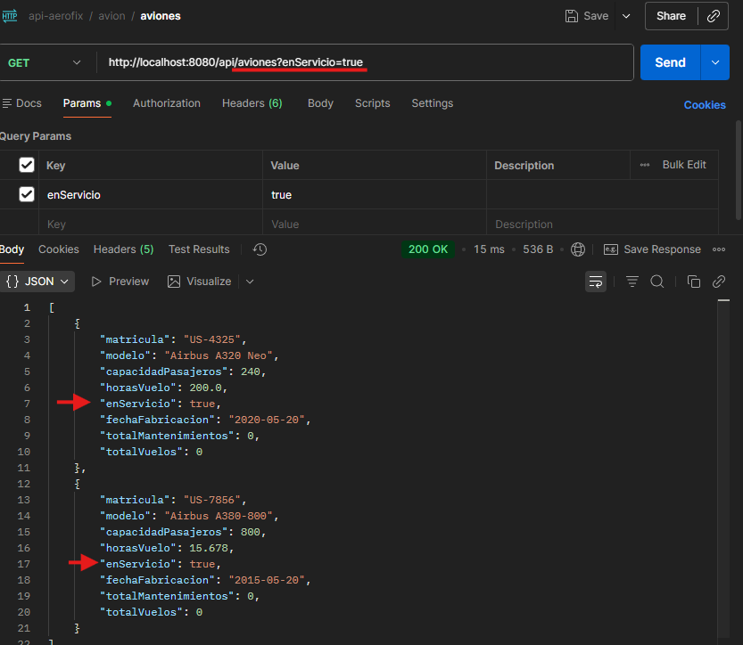

# AeroFix API 


API REST desarrollada con Spring Boot para la gestión integral de un taller de mantenimiento de aeronaves.

## 📋 Descripción
Este proyecto implementa una API Web para gestionar aviones, mecánicos, piezas, mantenimientos y registros de vuelo. Ha sido desarrollada siguiendo buenas prácticas de ingeniería de software, incluyendo arquitectura por capas, validaciones, control de excepciones y testing automatizado.

## 🚀 Tecnologías Utilizadas
* **Java 21**
* **Spring Boot 3.5.8**
* **PostgreSQL** (Persistencia de datos)
* **Spring Data JPA / Hibernate** (ORM)
* **OpenAPI 3.0 (Swagger)** (Documentación interactiva)
* **Mockito** (Tests Unitarios y de Integración)
* **WireMock** (Simulación de API externa)
* **ModelMapper** (Transformación Entidad-DTO)

## ⚙️ Requisitos Previos
Para ejecutar este proyecto necesitas:

1.  **Java JDK 21** instalado.
2.  **PostgreSQL** ejecutándose en el puerto `5432`.
3.  Tener creada una base de datos y un usuario con los siguientes credenciales (o configurarlos en `application.properties`):
    * **Base de datos:** `aerofix_db`
    * **Usuario:** `aerofix_user`
    * **Contraseña:** `aerofix_pass`

## 🛠️ Instalación y Ejecución

### 1. Clonar el repositorio
```bash
git clone https://github.com/devneda/aerofix-api.git
cd aerofix-api
```

### 2. Ejecutar la aplicación
Puedes usar el wrapper de Maven incluido. Esto descargará todas las dependencias y arrancará el servidor:

```bash
./mvnw spring-boot:run
```

## 📚 Documentación (Swagger UI)

Una vez iniciada la aplicación, la documentación interactiva OpenAPI 3.0 está disponible en:

👉 http://localhost:8080/swagger-ui/index.html

Desde aquí puedes probar todos los endpoints (GET, POST, PUT, DELETE, PATCH).

También tienes disponible el fichero `aerofix.yaml` en la raíz del proyecto para que la pruebes
con una herrmienta de APIs externa. 

## ✅ Testing

El proyecto cuenta con una amplia cobertura de tests que aseguran la calidad del código:

* **Unitarios (Service):** Lógica de negocio aislada con Mockito.
* **Integración (Controller):** Pruebas de endpoints HTTP y códigos de estado con `@WebMvcTest`.
* **Mock Externo:** Simulación de conexión a API de proveedor de piezas usando **WireMock**.

Para ejecutar todos los tests:
```bash
./mvnw test
```

## 🚀 Probando la API con Postman

A continuación se muestra el flujo de trabajo básico para gestionar aviones en la aplicación:

### 1. Listar Aviones (GET)
Obtenemos el listado general para ver los aviones disponibles inicialmente.


---

### 2. Registrar un Nuevo Avión (POST)
Creamos un nuevo avión enviando el JSON con los datos necesarios. La API devuelve el objeto creado con su ID asignado (campo `matricula`).


---

### 3. Consultar el Avión Creado (GET por ID)
Usamos el ID generado en el paso anterior para verificar que el avión se ha guardado correctamente en la base de datos.


---

### 4. Búsqueda con Filtros (GET)
Ejemplo de petición utilizando **Query Params** para filtrar los resultados. En este caso, solicitamos únicamente los aviones que se encuentran actualmente **en servicio**.

